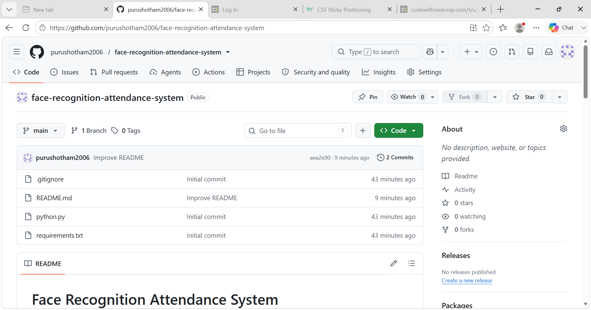

# Face Recognition Attendance System

A desktop attendance application built with Python, OpenCV, and Tkinter. The app captures face samples, trains an LBPH face recognition model, recognizes users through a webcam, and stores attendance records in a CSV file.



## Highlights

- Register users with a unique ID and name
- Capture face samples from a webcam
- Train a local face recognition model
- Recognize registered users in real time
- Save attendance with date and time in `attendance.csv`
- Preview recent attendance from the Tkinter dashboard
- Use a cleaner UI with stats, status cards, and quick actions

## Tech Stack

- Python
- OpenCV (`opencv-contrib-python`)
- NumPy
- Pillow
- Tkinter
- CSV for lightweight local storage

## Requirements

- Python 3
- Webcam
- Windows, Linux, or macOS with camera access

## Installation

```powershell
pip install -r requirements.txt
```

## Run The Project

```powershell
python python.py
```

## How It Works

1. Register a new user with a unique user ID and name
2. Capture face samples from the webcam
3. Train the LBPH recognizer using saved images
4. Start live recognition to identify registered users
5. Save attendance automatically with timestamps

## Interface Features

- Dashboard cards for registered users, face samples, and attendance entries
- Recent attendance preview window
- Status updates after key actions
- Quick access to the local project folder

## Project Files

- `python.py` - main application
- `requirements.txt` - Python dependencies
- `users.csv` - registered user IDs and names
- `attendance.csv` - attendance records with timestamps
- `dataset/` - stored face sample images
- `trainer/` - trained recognizer model
- `docs/project-page.png` - repository preview image used in the README

## Privacy Notes

- Generated files and personal data are excluded by `.gitignore`
- `attendance.csv` and `users.csv` stay local by default unless you choose to upload them
- Make sure no other application is using the webcam while the app is running

## Future Improvements

- Export attendance to Excel
- Add admin login or password protection
- Improve duplicate-user detection
- Store data in a database instead of CSV
- Package the app as a standalone desktop executable

## Resume Summary

Built a face recognition attendance system using Python, OpenCV, and Tkinter that captures face samples, trains an LBPH model, performs live recognition through a webcam, and records attendance in CSV files.

For more resume and LinkedIn versions, see [PROJECT_PROFILE.md](PROJECT_PROFILE.md).

## License

This project is released under the MIT License. See [LICENSE](LICENSE).
